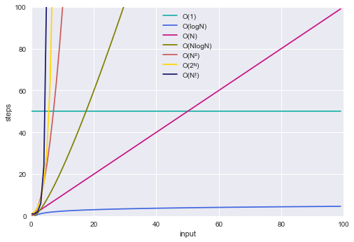

# The Big O Notation

An algorithm’s performance depends on the number of steps it takes. Computer Scientists have borrowed the term ‘__Big-O Notation__’ from the world of mathematics to accurately describe an algorithm’s efficiency. 

## Introduction
### Time Complexity
Instead of focusing on units of time, __Big-O__ puts the _number of steps_ in the spotlight. The hardware factor is taken out of the equation. Therefore we are not talking about _run time_, but about _time complexity_.

### Big-O Definition
An algorithm’s __Big-O notation__ is determined by how it responds to different sizes of a given dataset. For instance how it performs when we pass to it 1 element vs 10,000 elements.
__O__ stands for __Order Of__, so __O(N)__ is read “__Order of N__” — it is an _approximation of the duration of the algorithm given N input elements_. It answers the question: “How does the number of steps change as the input data elements increase?”

_O(N) describes how many steps an algorithm takes based on the number of elements that it is acted upon._

### Best vs Worst Scenario
Starting with a gentle __example__: Given an input array[N], and a value X, our algorithm will search for the value X by traversing the array from the start until the value is found.
Given this 5-element array: [2,1,6,3,8] if we were searching for X=8 the algorithm would need 5 steps to find it, but if we were searching for X=2 it would only take 1 step. So best case scenario is when we look for a value that is in the first cell and worst case scenario is when the value is at the last cell, or not there at all.

The Big-O notation takes a pessimistic approach to performance and refers to the worst case scenario. This is really important when we describe the complexities below, and also when you try to compute the complexity of your own algorithms: _Always think of the worst case scenarios_.

#### O(1) — Constant
__O(1)__ means that the algorithm takes the same number of steps to execute regardless of how much data is passed in.

_Example_:Determine if the i-th element of an array is an odd number.

Whether we access the 1st or 2nd or millionth item it doesn’t matter… We can access it directly by using the index operator array[i]

```py
import numpy as np
array = np.array([0, 2, 3, 6, 0, 8, 5, 5, 2])
def isNthElementOdd(array, n):
    return bool(array[n] % 2)
isOdd = isNthElementOdd(array, 2)
print(isOdd)
# True
```
If we were to represent the number of steps (y-axis) vs the number of input elements (x-axis), O(1) is a perfect horizontal line, since the number of steps in the algorithm remains constant no matter how much data there is. This is why it is called __constant time__.

#### O(N) — Linear
An algorithm that is __O(N)__ will take as many steps as there are elements of data. So when an array increases in size by one element, an __O(N) algorithm__ will increase by one step.

_Exampl_: Traverse an array and print each element.

Here, we need to access all the elements one by one, so the calculation time increases at the same pace as the input.

```py
import numpy as np
array = np.array([0, 2, 3, 6, 0, 8, 5, 5, 2])
def displayAllItems(array):
    for i in array:
        print(i, end = ' ')
dsiplayAllItems(array)
```
__O(N)__ is a perfect _diagonal line_, as for every additional piece of data, the algorithm takes one additional step. This is why it is also referred to as __linear time__.

#### O(N²) — Quadratic
__O(N²)__ represents the _complexity of an algorithm_, whose performance is proportional to the square of the size of the input elements. It is generally quite slow: If the input array has 1 element it will do 1 operation, if it has 10 elements it will do 100 operations, and so on.

_Example_: Find duplicates in an array

This is a ‘naive’ implementation, but it traverses the array twice:
```py
import numpy as np
array = np.array([0, 2, 3, 6, 0, 8, 5, 5, 2])
def containsDuplicates(array):
    for i, outter_element in enumerate(array):
        for j, inner_element in enumerate(array):
            if (i == j):
                continue
            if (outter_element == inner_element):
                return True
    return False
duplicates = containsDuplicates(array)
print(duplicates)
```
Adding more nested iterations through the input will increase the algorithm’s complexity: e.g. if the number of iterations is 3 then its complexity will be O(N³) and so forth. Usually, we want to stay away from polynomial running times (quadratic, cubic, Nˣ, etc).

The O(N²) line is a sharp curve

#### O(logN) — Logarithmic
Simply put, __O(logN)__ describes an algorithm that its number of operations increases by one each time the data is doubled.

__Recall__: 
>> You may not remember what logarithms are, but you probably know what exponents are:

>> 2³ = 2 * 2 * 2 = 8 — Here we multiply the number 2, 3 times.

>> Logarithms are the flips of exponents.

>> log₂8 answers the question: how many 2s do we multiply together to get 8? The answer is 3.

>> In other words, if we keep dividing 8 by 2 until we end up to 1, how many 2s do we have in our equation?

>> 8 / 2 / 2 / 2 = 1. The answer is 3 again.

_Example_: Logarithmic time complexities usually apply to algorithms that divide problems in half every time: e.g., Dictionary lookup (aka binary search)
1. Open the dictionary in the middle and check the first word.
2. If our word is alphabetically more significant, look in the right half, else look in the left half.
3. Divide the remainder in half again, and repeat steps 2 and 3 until we find our word.
```py
sortedArray = ['bash', 'c', 'go', 'java', 'javascript', 'python', 'ruby', 'sq;']
def binarySearch(array, element):
    first = 0
    last = len(array) - 1
    index = -1

    while (first <= last) and (index == -1):
        mid = (first + last) // 2
        if array[mid] == element:
            return True
        elif element < array[mid]:
            last = mid -1
        else:
            first = mid + 1
        return False
found = binarySearch(sortedArray, 'python')
print(found)
```
We can only pick one possibility per iteration, and our pool of possible matches gets divided by two in each iteration. This makes the time complexity of binary search O(logN). The number of steps barely increase, as the input grows (i.e. it takes just one additional step each time the data doubles):

### O(N logN) — Log-linear
An algorithm of this complexity class is doing __log(N)__ work N times and therefore its performance is slightly worse than O(N). Many practical algorithms belong in this category (from sorting, to pathfinding, to compression), so we are mentioning it for completeness.

_Example_: Merge Sort — it is a ‘Divide and Conquer’ algorithm: it divides the input array in two halves, calls itself for each one and then merges the two sorted halves.

_Scalability_: Average.

### O(2ᴺ) — Exponential
__Exponential growth__ means that the algorithm takes twice as long for every new element added.

_Example_: Find all subsets in a dataset.

_Scalability_: Poor.

### O(N!) — Factorial
This class of algorithms has a run time proportional to the factorial of the input size: n! = n * (n-1) * (n-2) * (n-3) * . . . * 1.

_ Example_: Find all different permutations in a dataset.

_Scalability_: Very Poor.

## Growth Hierarchy
The Big-O notation offers a consistent mechanism to compare any two algorithms and hence help us make our code faster and more scalable. Putting all of the complexities in a single graph, we can observe in a visual manner how they compare in terms of performance:



## Conclusion
* Algorithm speed is not measured in seconds but in terms of growth
* The Big-O Notation tells us how an algorithm scales against changes in the input dataset size
* O stands for Order Of — as such the Big-O Notation is approximate
* Algorithm running times grow at different rates:

>> __O(1) < O(logN) < O(N) < O(N logN) < O(N²) < O(2ᴺ) < O(N!)__


__Reference__:
1. https://towardsdatascience.com/the-big-o-notation-d35d52f38134